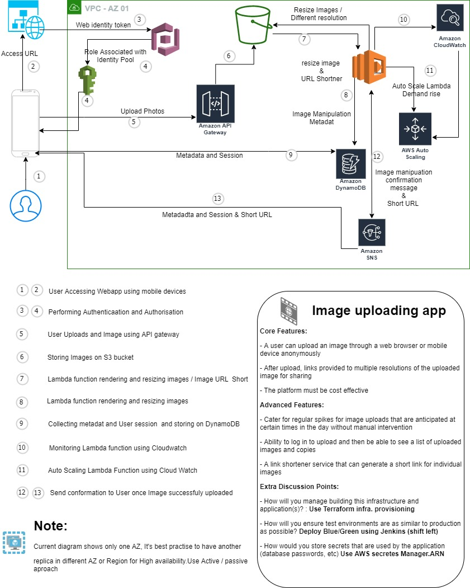
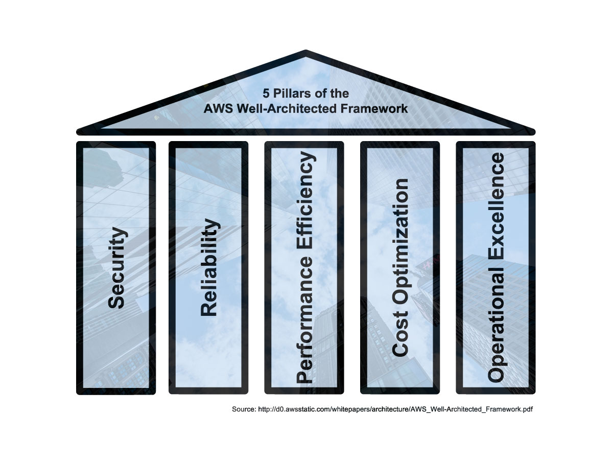

# **Cloud Solution Architect :**

**Introduction:** 

AWS Well architected framework is fundamental to Design, Built, Deploy and Monitor an application. Sometime you don’t know where to begin:

- Where do I start from?
- I’m not sure where to begin?

In this post I will go through AWS Well architected framework pillars, which will try to answer some of the question.

## **There are five AWS Architected framework pillars :**
### **1.    Security**
### **2.	Resilience by design or Reliability**
### **3.	Cost Optimisation**
### **4.	Performance Efficiency**
### **5.	Operation Excellence**

**====================================**
## **1.	Security :** 
 Security is far most important in terms of cloud native best practices and should be considered first:
Some of the key security best practices you must consider:
-	Implement strong identity foundation 
-	Least privilege using IAM roles, policies ad groups
-	Enforce separation of duties with right access level
-	Audit: Centralize privilege management
-	Monitor using CloudTrail for user activity
-	Enforce security at all level: such as EC2 instance, VPC, edge- loc, subnet, LB, OS and Application.
-	Automate security best practices
-	Protect data in transit and at rest
-	Prepare for security events: Playbooks, Response plan, Incident response plan.

Finally I want to draw your attention to something called Shared Responsibility:

- AWS is responsible for security of Cloud: 
It is AWS’s responsibility to secure Network Configuration, Compute, Storage, DB and Network, Region, Availability Zone, edge location.

- Customer is responsible for security in the Cloud: 
Platform, Application, Identity and Access management, Firewall OS Data, data encryption, data integrity, securing DB, S3 
In other words what services you provision on AWS cloud it’s AWS responsibility to make it available to you resources you have specified during initial setup. i.e If you have used Terraform to provision five EC2 instances it will make sure you have Five EC2instanace all the time for you to use. Make it available 24/7. On the other hand if you are responsible for patching and configuring security of EC2 instance for example Configuring security groups, adding Network Access Control Lists (NACLs) and Scheduling DB backups.

### **2.	Resilience by design or Reliability**

Providing reliability by automating Recovery, Scaling and Backup are key to Resilience by design model. This should not be manual process. 
-	Test recovery procedure
-	Automatically recover from failure
-	Scaling horizontal (De-coupling)
-	Stop guessing capacity, Measure server capacity using monitoring logs, Track hardware capacity.
-	Use Multi AZ for high availability and reliability.
-	Store data in S3 bucket instead of local machine
-	Use Elastic Load Balance with Web servers.

## **3.	Cost Optimisation**
Cost Optimisation is achieved by provisioning least expensive resource while properly implemented security.
Some of the key questions to be answer are:
-	Does your client need this application running 24/7?? Can it be stopped?
-	What business value does this application bring? measuring overall efficiency 
-	Expenditure awareness: Know where the cost coming from by implements proper Billing services: weekly, Bi-monthly, Monthly, Bi-Annually etc.
-	Optimize overtime, Match supply with demand

## **4.	Performance Efficiency**
Performance Efficiency is to serve number of users you need to serve in the amount of time that is acceptable. i.e How many users can your application handle per second / per minute , Throughputs, latency.

While planning for Performance efficiency considers this aspects of cloud:

    o	Use serverless architecture: Use AWS Lambda and  API Gatwway 
    o	Go global in minutes architecture: Deploy your application in multi AZ. Can choose Active/Active OR Active/Passive approach. 
    o	Auto scaling: Log and monitor scale of actions, when, why scaling happened so you can optimize you application.

## **5.	Operation Excellence**

Operation Excellence involves three steps Prepare, Operate and Evolve. 

**Prepare :** 

    o	Learn about expected behaviors and workloads,

    o	Consider operational priorities: for example: Sales, Customer Management

    o	Design for operations: Multi AZ, multi cluster, Region

    o	Make sure team is ready to rollout changes as needed

**Operate :**

    o	Monitor: Make sure to setup monitoring solution to gain insight of Environment health, to understand user behaviors, under perform areas and discover business and technical insight. Use AWS CloudWatch, Cloud Trail and AWS X-Ray to monitor. You may use third-party tools such as Datadog, ELK Stack, Grafana and Prometheus. 

    o	Respond: Make sure you have plan ready for Security, Reliability, Performance and Cost related issues. Response Incident Management.

**Evolve :**

    o	Learning from experience for better customer support 
    o	Share learning with counterparts
    o	Scale In / Out if needed. 

[**<< Previous Page**](/Readme.md)