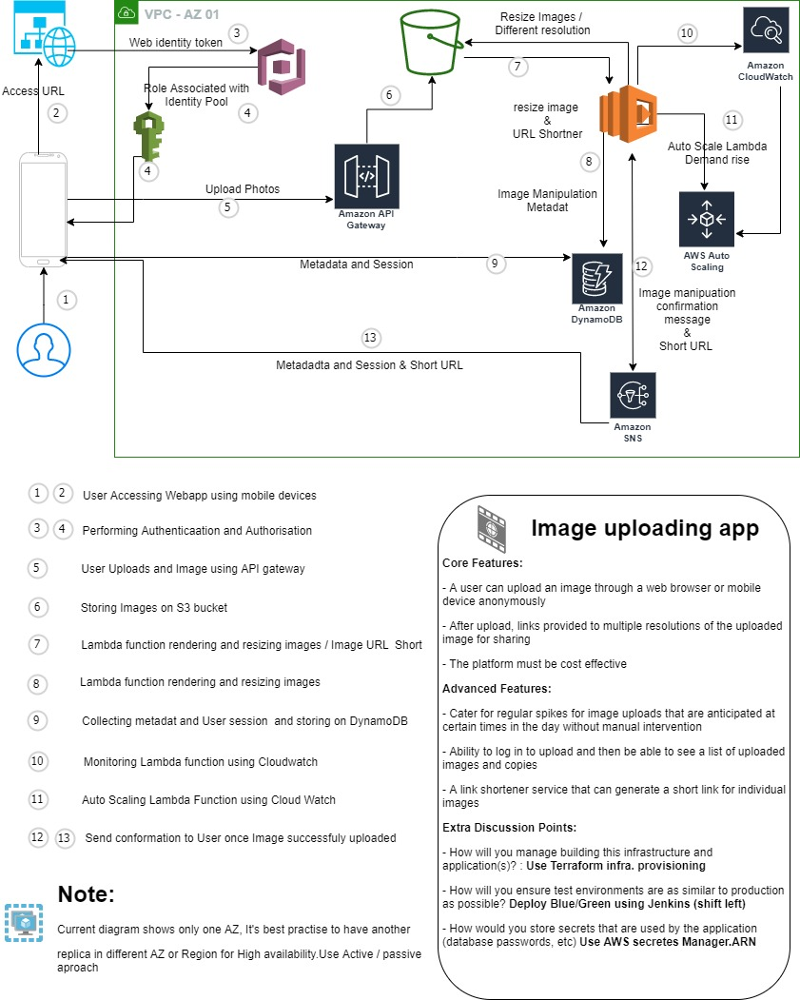

# **Platform Engineer :**

- Use Terraform modules to provision AWS resources such as VPC, IAM role, S3 bucket, SNS, API gateway, DynamoDB and Cloud watch

### **There are five AWS Architected framework pillars :**
##### **1.    Security**: Create New VPC, Create Public-Subnet and Private subnet for Network isolation, create Network Access Control Lists (NACL) and Security (SG) for Ingress /  Egress traffic control. Attached Web Application Firewall for prevending DDos

##### **2.	Resilience by design or Reliability**: Design Mylti AZ / Region application
##### **3.	Cost Optimisation**: Use Billing Dashboard, to monitor, Do you realy need 24/7 app. Use AutoScaling for Scaling In / Out
##### **4.	Performance Efficiency** : Use Serverless architecture Lambda function, API Gateway
##### **5.	Operation Excellence**: prapare, Operate and Evolve, Laverage Cloudwatch, CloudTrail and X-Ray OR ELK Stack, Kibana, Grafana or Datadog

[**Read more on Well Architected Framework - Next Page >>**](/BJSS/Readme-WAF.md)
